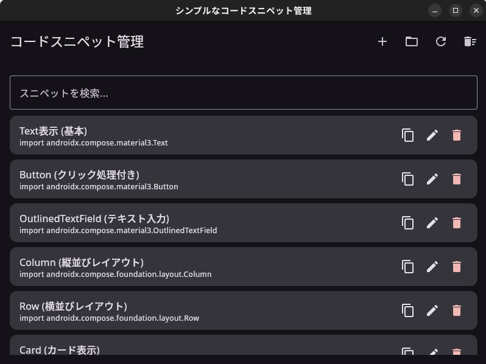
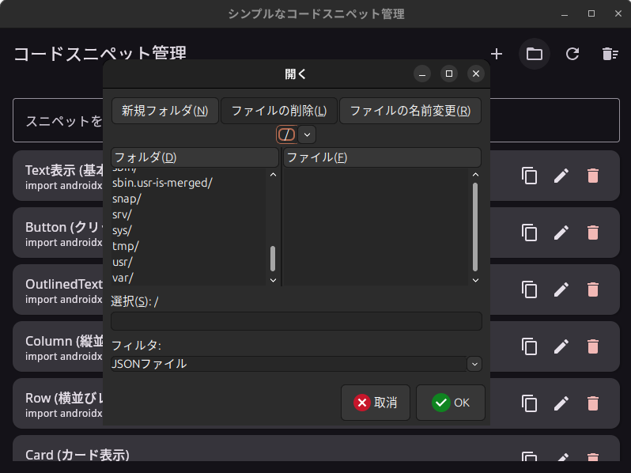

# SnippetButton

## 日本語

[TOC]

### TL;DR

SnippetButton は、コードスニペットを効率的に管理するためのシンプルなデスクトップアプリケーションです。Jetpack Compose for Desktop を使用して構築されており、クロスプラットフォームで動作します。

### アプリケーションアイコン
- `SnippetButton-icon.png` は生成AI（例：Midjourney）で作成しました。

### 利用方法

#### ホーム画面

1.  [リリースページ](https://github.com/dopqLOL/SnippetButton/releases)から最新のZIPファイルをダウンロードします。
2.  ダウンロードしたZIPファイルを展開します。
3.  展開されたフォルダにある実行ファイルを起動します。

#### スニペットの検索
画面上部の検索バーにキーワードを入力すると、タイトルまたはコードにキーワードが含まれるスニペットが絞り込まれます。

#### スニペットの追加
1.  画面上部の「+」ボタンをクリックします。
   
2.  ダイアログでタイトルとコードを入力します。
3.  「保存」をクリックしてリストに追加します。

#### スニペットの編集と削除
各スニペットアイテムの編集ボタンで内容を編集し、削除ボタンでスニペットを削除できます。

#### スニペットのインポート
1.  画面上部のインポートボタンをクリックします。
   
2.  ファイル選択ダイアログで JSON ファイルを選択して「開く」をクリックします。
3.  選択したスニペットがリストに追加されます。

#### スニペットデータの保存場所
-  Windows: `%USERPROFILE%\.snippet_manager_data.json`
-  macOS/Linux: `$HOME/.snippet_manager_data.json`

#### 追加機能
* 🔄 **リセット (初期化):** ツールバーのリフレッシュアイコンをクリックし、「はい」を選択するとデフォルトスニペットに戻ります。
* 🗑 **一括削除:** ツールバーのゴミ箱アイコンをクリックし、「はい」を選択するとすべてのスニペットを削除します。

## English

[TOC]

### TL;DR

SnippetButton is a simple desktop application for efficient code snippet management. It is built with Jetpack Compose for Desktop and runs cross-platform.

### Icon

The application icon (`SnippetButton-icon.png`) was generated using AI (e.g., Midjourney).

### Usage

#### Home Screen

1.  Download the latest ZIP file from [https://github.com/dopqLOL/SnippetButton/releases](https://github.com/dopqLOL/SnippetButton/releases).
2.  Extract the downloaded ZIP file to any location.
3.  Run the executable file corresponding to your operating system in the extracted folder.

#### Snippet Search

Enter a keyword in the search bar at the top of the screen to filter snippets whose title or code contains the keyword.

#### Adding Snippets

1.  Click the "+" button at the top of the screen.
   
2.  Enter the title and code for the snippet in the displayed dialog.
3.  Click the "Save" button to add the snippet to the list.

#### Editing and Deleting Snippets

Each item in the snippet list displays "Edit" and "Delete" buttons.

*   **Edit:** Clicking the edit button displays a dialog where you can modify the snippet's content.
*   **Delete:** Clicking the delete button removes the snippet from the list.

#### Importing Snippets

1.  Click the "Import" button at the top of the screen.
   
2.  In the displayed file selection dialog, select the JSON file containing the snippet data and click "Open".
3.  The snippets will be added to the list.

#### Snippet Data Storage Location

Snippet data is stored in JSON format in the following location:

*   Windows: `%USERPROFILE%\.snippet_manager_data.json`
*   macOS/Linux: `$HOME/.snippet_manager_data.json`

You can directly edit this file to add or modify snippets. However, ensure that the JSON format is correct and that you restart the application if you edit the file while the application is running.

#### Additional Features

* 🔄 **Reset to Default:** Click the refresh icon in the toolbar and confirm to reload default snippets.
* 🗑️ **Clear All:** Click the trash icon in the toolbar and confirm to remove all snippets.
