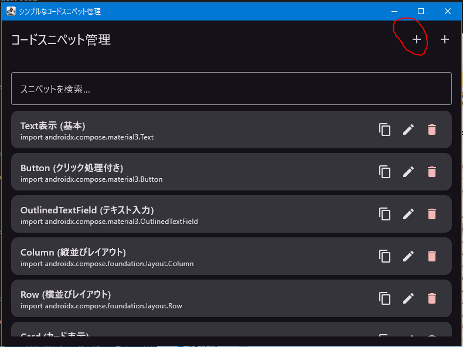

# SnippetButton

## 日本語

[TOC]

### 概要

SnippetButton は、コードスニペットを効率的に管理するためのシンプルなデスクトップアプリケーションです。Jetpack Compose for Desktop を使用して構築されており、クロスプラットフォームで動作します。

### 利用方法

1.  [https://github.com/dopqLOL/SnippetButton/releases](https://github.com/dopqLOL/SnippetButton/releases) から最新のZIPファイルをダウンロードします。
2.  ダウンロードしたZIPファイルを任意の場所に展開します。
3.  展開されたフォルダ内にある、お使いのOSに対応した実行可能ファイルを実行します。

#### スニペットの追加

1.  画面上部の「+」ボタンをクリックします。  
2.  表示されるダイアログで、スニペットのタイトルとコードを入力します。
3.  「保存」ボタンをクリックすると、スニペットがリストに追加されます。

#### スニペットの編集と削除

スニペットリストの各アイテムには、「編集」ボタンと「削除」ボタンが表示されます。

*   **編集:** 編集ボタンをクリックすると、スニペットの内容を編集できるダイアログが表示されます。
*   **削除:** 削除ボタンをクリックすると、スニペットがリストから削除されます。

#### スニペットのインポート

1.  画面上部の「インポート」ボタンをクリックします。 ）
2.  表示されるファイル選択ダイアログで、JSON形式のスニペットデータが保存されたファイルを選択し、「開く」をクリックします。
3.  スニペットがリストに追加されます。

#### スニペットデータの保存場所

スニペットデータは、以下の場所にJSON形式で保存されます。

*   Windows: `%USERPROFILE%\.snippet_manager_data.json`
*   macOS/Linux: `$HOME/.snippet_manager_data.json`

このファイルを直接編集することで、スニペットを直接追加・編集することも可能です。ただし、JSON形式が正しいこと、アプリケーション起動中にファイルを編集した場合は再起動が必要であることに注意してください。

#### スニペットの検索

画面上部の検索バーにキーワードを入力すると、タイトルまたはコードにキーワードが含まれるスニペットが絞り込まれます。

## English

[TOC]

### Overview

SnippetButton is a simple desktop application for efficient code snippet management. It is built with Jetpack Compose for Desktop and runs cross-platform.

### Usage

1.  Download the latest ZIP file from [https://github.com/dopqLOL/SnippetButton/releases](https://github.com/dopqLOL/SnippetButton/releases).
2.  Extract the downloaded ZIP file to any location.
3.  Run the executable file corresponding to your operating system in the extracted folder.

#### Adding Snippets

1.  Click the "+" button at the top of the screen   
2.  Enter the title and code for the snippet in the displayed dialog.
3.  Click the "Save" button to add the snippet to the list.

#### Editing and Deleting Snippets

Each item in the snippet list displays "Edit" and "Delete" buttons.

*   **Edit:** Clicking the edit button displays a dialog where you can modify the snippet's content.
*   **Delete:** Clicking the delete button removes the snippet from the list.

#### Importing Snippets

1.  Click the "Import" button at the top of the screen  
2.  In the displayed file selection dialog, select the JSON file containing the snippet data and click "Open".
3.  The snippets will be added to the list.

#### Snippet Data Storage Location

Snippet data is stored in JSON format in the following location:

*   Windows: `%USERPROFILE%\.snippet_manager_data.json`
*   macOS/Linux: `$HOME/.snippet_manager_data.json`

You can directly edit this file to add or modify snippets. However, ensure that the JSON format is correct and that you restart the application if you edit the file while the application is running.

#### Snippet Search

Enter a keyword in the search bar at the top of the screen to filter snippets whose title or code contains the keyword.# somadevfat-SnippetButton
